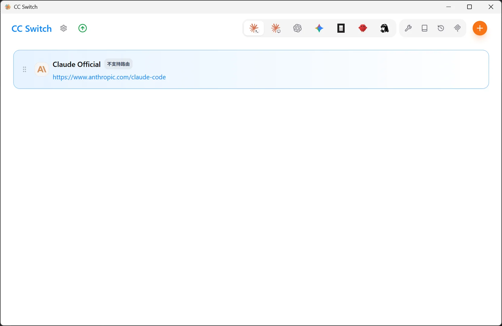
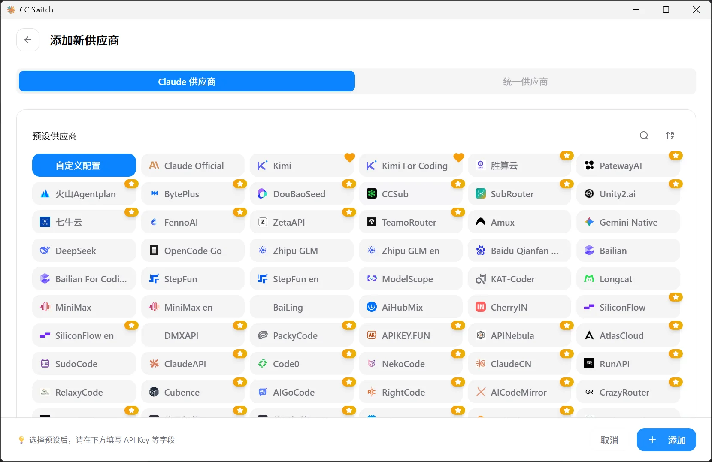
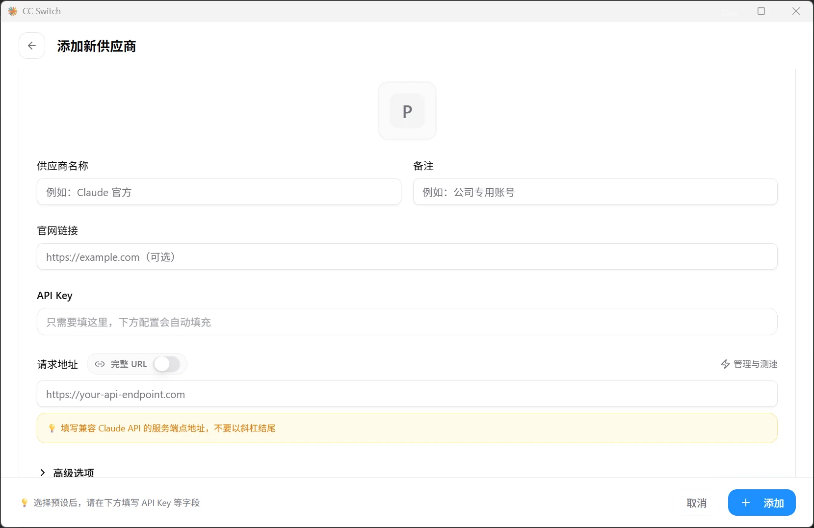
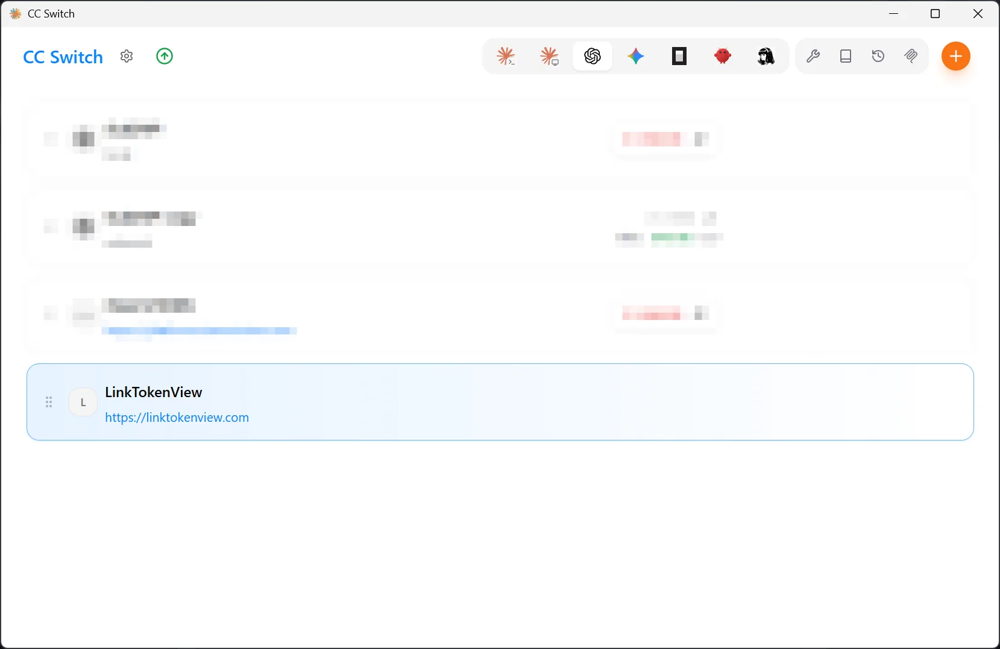

# CC Switch 接入

使用 CC Switch 为目标 Agent 工具添加 LinkTokenView 配置。

## 配置前

- 已完成[注册与登录](/getting-started)。
- 已创建 LinkTokenView API 密钥，详见[创建 API 密钥](/api-keys)。
- 已安装并能正常打开当前版本的 CC Switch。
- 已确定要配置的 Agent 工具（如 Claude Code、Claude Desktop、Codex CLI、Codex Desktop、Gemini CLI 等）。

- **官方网站**：[https://ccswitch.io/zh/](https://ccswitch.io/zh/)
- **下载地址**：[https://ccswitch.io/zh/](https://ccswitch.io/zh/)
- **官方文档**：[https://ccswitch.io/zh/docs?section=getting-started](https://ccswitch.io/zh/docs?section=getting-started)

## 1. 选择工具

启动 CC Switch，点击顶部工具栏中的目标工具图标：

- **Claude**：Claude Code、Claude 桌面版
- **Codex**：Codex CLI、Codex 桌面版
- **Gemini**：Gemini CLI

## 2. 添加供应商

### 2.1 打开添加页面

点击右上角的 **+** 按钮，进入「添加新供应商」页面。

- **Claude 供应商 / Codex 供应商 / Gemini 供应商**：适配对应工具协议的预设供应商列表
- **统一供应商**：通用配置，适用于所有工具类型

### 2.2 选择配置类型

页面提供两种配置方式：

- **预设供应商**：选择已有模板，只需填写 API Key。
- **自定义配置**：点击「自定义配置」，手动填写配置字段。

### 2.3 填写字段

选择「自定义配置」后，需要填写以下字段：

| 字段 | 填写内容 |
|------|---------|
| 供应商名称 | 自定义名称，如「LinkTokenView」 |
| 备注 | 可选，便于区分多个供应商 |
| 官网链接 | 可选，填写 `https://linktokenview.com` |
| API Key | 你的 LinkTokenView API 密钥 |
| 请求地址（Base URL） | `https://linktokenview.com`（不要以斜杠结尾） |

> 请求地址因工具而异。CC Switch 使用根地址 `https://linktokenview.com`，不要添加 `/v1`；WorkBuddy 的地址不同，请按 [WorkBuddy 接入](/agents/workbuddy)填写。

> 选择预设供应商时，供应商名称、官网链接和请求地址会自动填充。

### 2.4 高级选项

展开「高级选项」可配置以下内容：

- **上游格式**：根据供应商支持的协议选择（Anthropic Messages、Chat Completions、Responses 等）
- **认证字段**：选择 API Key 的传递方式（Authorization 或 x-api-key）
- **模型映射**：配置请求模型与实际模型的映射关系
- **默认模型**：设置默认使用的模型名称

> 不确定时保留默认设置。

填写完成后，点击右下角的 **+ 添加** 按钮保存配置。

## 3. 切换并验证

### 3.1 切换供应商

保存后，在供应商列表中点击该条目，切换到当前配置。

### 3.2 重新打开工具

完全退出并重新打开目标 Agent 工具。

### 3.3 发起请求

在目标工具中发起一次实际请求，确认返回正常结果。

## 出错时

记录以下信息，再按[配置失败排查](/troubleshooting/configuration)处理：

- CC Switch 版本和目标 Agent 工具版本。
- 当前使用的配置类型（预设 / 自定义）。
- 完整错误提示。
- 配置保存后是否重新启动了目标工具。

如果需要手动配置，请先记录工具版本和配置入口；本页不提供未经实测的环境变量、配置文件路径或 JSON/TOML 示例。
