# DeepSeek Harness 接入

本页介绍在 DSH Desktop（DeepSeek Harness 桌面版）中添加 LinkTokenView 自定义提供方，并完成一次实际调用。

## 配置前

- 已完成[注册与登录](/getting-started)。
- 已创建 LinkTokenView API 密钥，详见[创建 API 密钥](/api-keys)。
- 已在[模型广场](/model-plaza)确认要使用的模型 ID。

### 确认下载来源

以下两个网站用途不同，下载安装包请以 DSH Desktop 官网为准：

| 名称 | 网址 | 说明 |
|------|------|------|
| DeepSeek Harness（官方框架） | [https://www.deepseek.com/harness/](https://www.deepseek.com/harness/) | DeepSeek 官方开源的 Agent 框架，开发者预览版。面向开发者，需要自行安装 Node.js 后通过命令行启动 |
| DSH Desktop 桌面端 | [https://dshdesktop.com](https://dshdesktop.com) | 社区维护的桌面封装版，将 DeepSeek Harness 封装为可直接安装的桌面应用。本页按此版本说明 |

> DSH Desktop 是独立的社区桌面封装项目，与 DeepSeek 官方无隶属关系。如不便使用命令行，可选择 DSH Desktop。

## 安装 DSH Desktop

1. 打开 [https://dshdesktop.com](https://dshdesktop.com)，点击 **立即下载**。
2. 运行下载好的安装包。

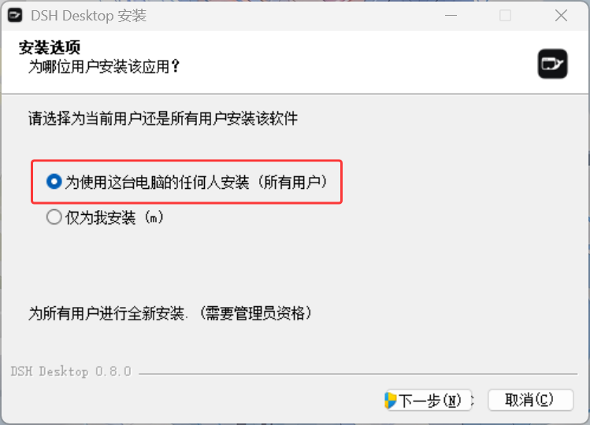

3. 在「安装选项」中选择 **为使用这台电脑的任何人安装（所有用户）**，点击 **下一步**。

> 选择「所有用户」需要管理员权限。

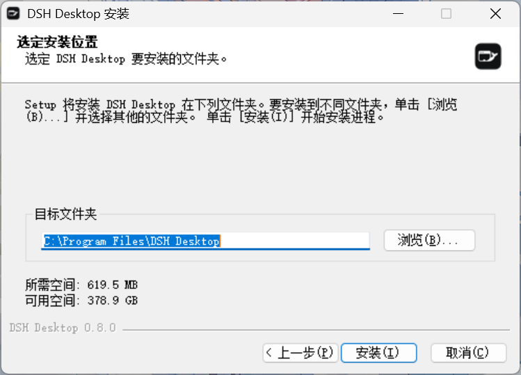

4. 确认「目标文件夹」，点击 **安装**。
5. 安装完成后勾选 **运行 DSH Desktop**，点击 **完成**。

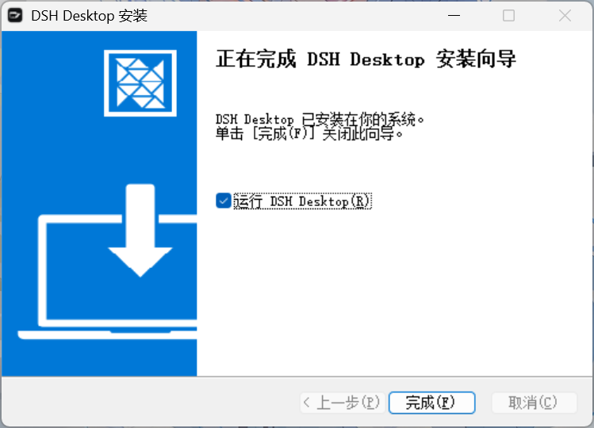

## 首次启动

首次启动需要初始化运行环境，界面显示「正在启动 DSH Desktop」，请等待其完成。

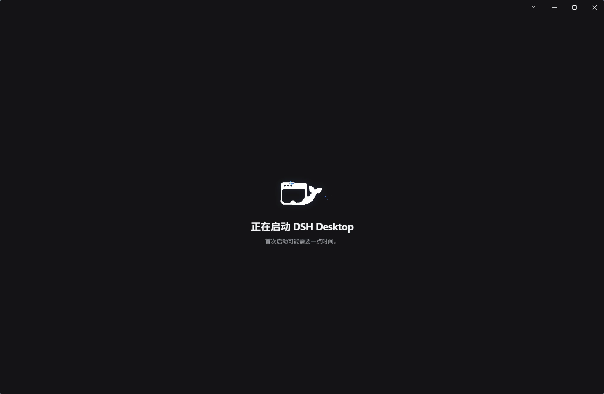

进入主界面后会弹出「接入模型提供方」窗口，要求填写 API 密钥。

1. 点击 **稍后配置**，先跳过内置提供方。
2. 点击左下角的 **设置**。

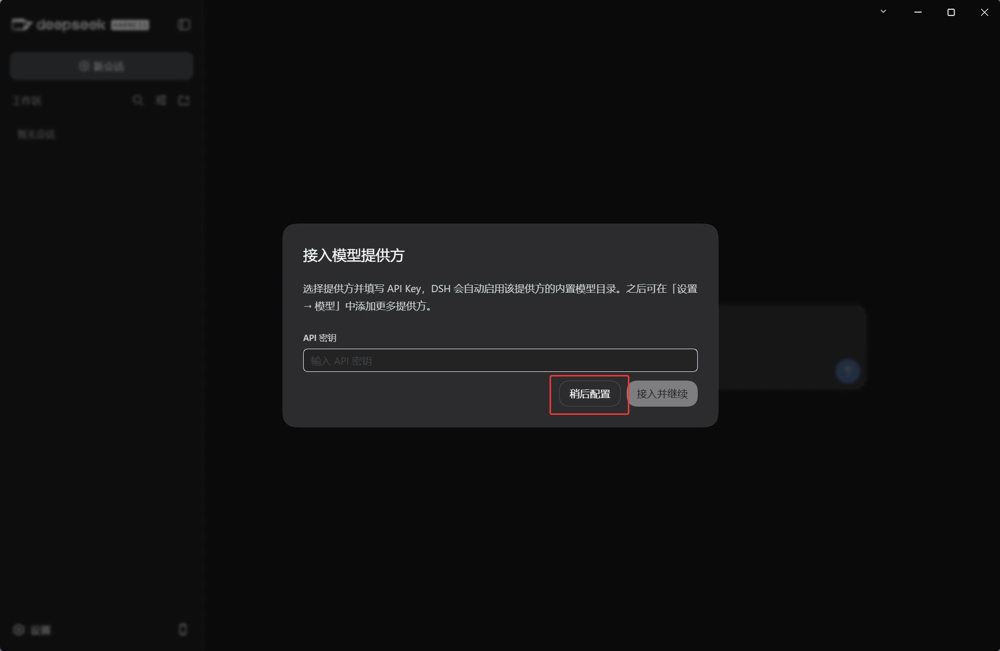

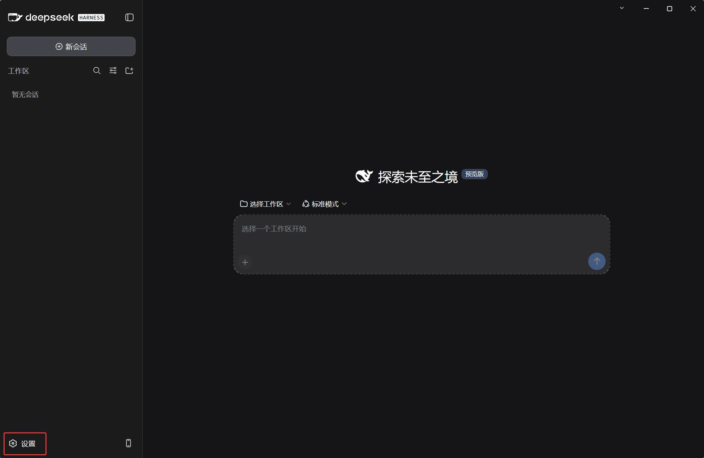

## 添加自定义提供方

1. 在设置面板左侧选择 **模型**。
2. 点击 **+ 添加自定义提供方**。

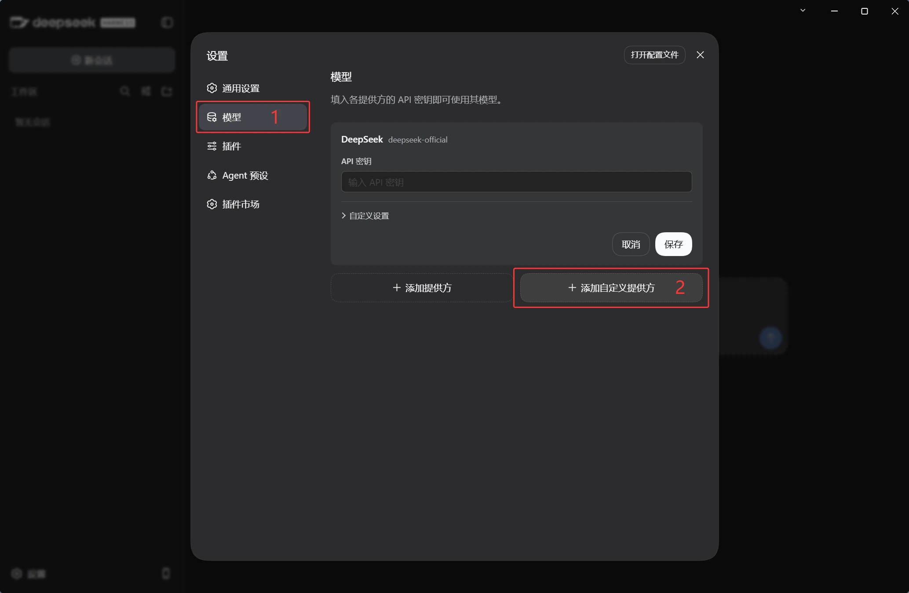

3. 填写以下字段：

| 字段 | 填写内容 |
|------|---------|
| Provider ID | `linktokenview` |
| 显示名称 | 可选，留空时显示 Provider ID |
| API 地址 | `https://linktokenview.com/v1` |
| API 协议 | `openai-completions` |
| API 密钥 | 你的 LinkTokenView API 密钥 |

> Provider ID 是以小写字母开头的标识，在请求中唯一标识该提供方。填写后不要随意修改。

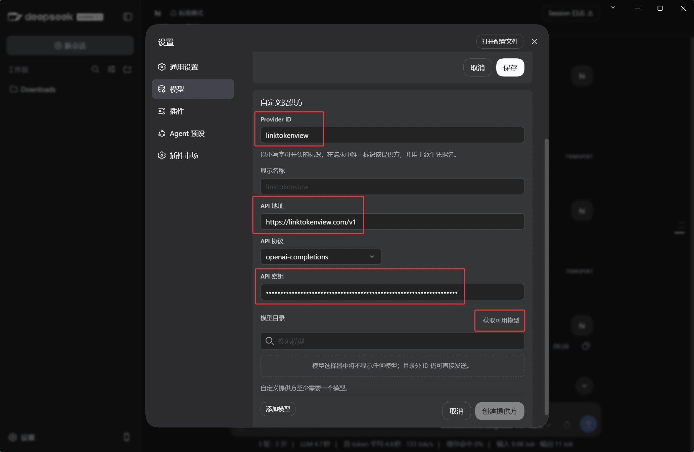

DSH Desktop 同时支持 `openai-responses` 与 `anthropic-messages` 协议，可按实际使用的接口选择。以下以 `openai-completions` 为例。

## 获取模型目录

1. 点击 **获取可用模型**，读取 LinkTokenView 的模型列表。
2. 在弹出的「选择要添加的模型」窗口中，勾选要使用的模型（例如 `deepseek-v4.1-flash`）。
3. 点击 **添加所选**。

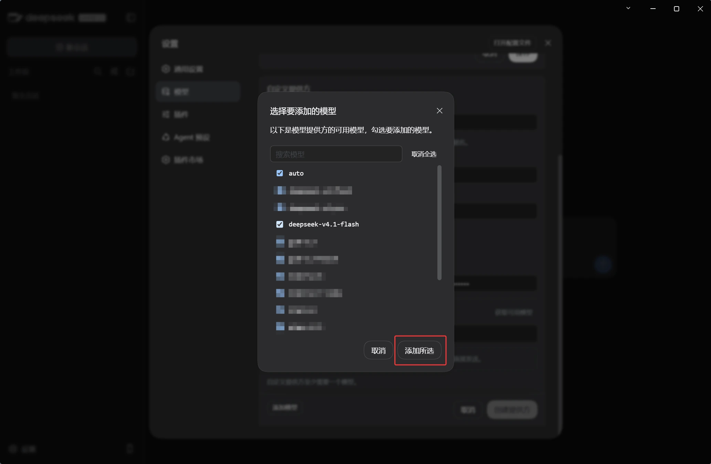

4. 回到自定义提供方页面，确认模型已出现在「模型目录」中。

> 列表中的 **视觉** 复选框用于标记该模型支持图片输入，按实际需要勾选。

5. 点击 **创建提供方** 保存。

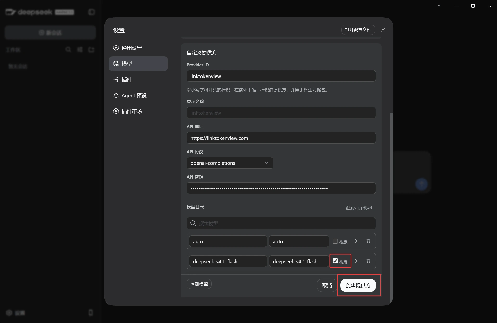

## 发起请求

1. 点击顶部的 **新会话**。
2. 点击 **选择工作区**，指定一个本地文件夹作为工作目录。

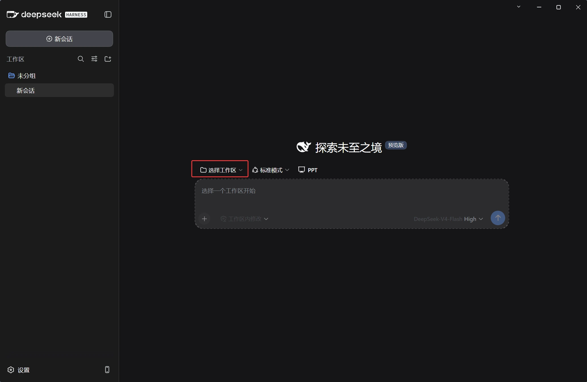

3. 点击输入框右下角的模型按钮，在 `linktokenview` 分组下选择刚添加的模型。

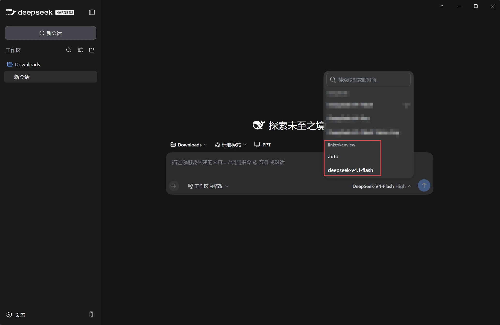

4. 在输入框中描述任务并发送，确认返回正常结果。

## 出错时

- 确认 API 地址为 `https://linktokenview.com/v1`，末尾需包含 `/v1`。
- 确认 API 密钥内容完整，且不含多余空格。
- 确认「模型目录」中已添加至少一个模型；未添加模型时无法创建提供方。
- 无法获取模型列表时，可通过 **添加模型** 手动填写模型 ID，模型 ID 以[模型广场](/model-plaza)为准。
- 确认模型仍在[模型广场](/model-plaza)显示。
- 没有对应配置类型时，不要复制其他工具的环境变量、配置文件、模型 ID 或 API 路由；请记录版本和错误提示，再查看[配置失败排查](/troubleshooting/configuration)。
