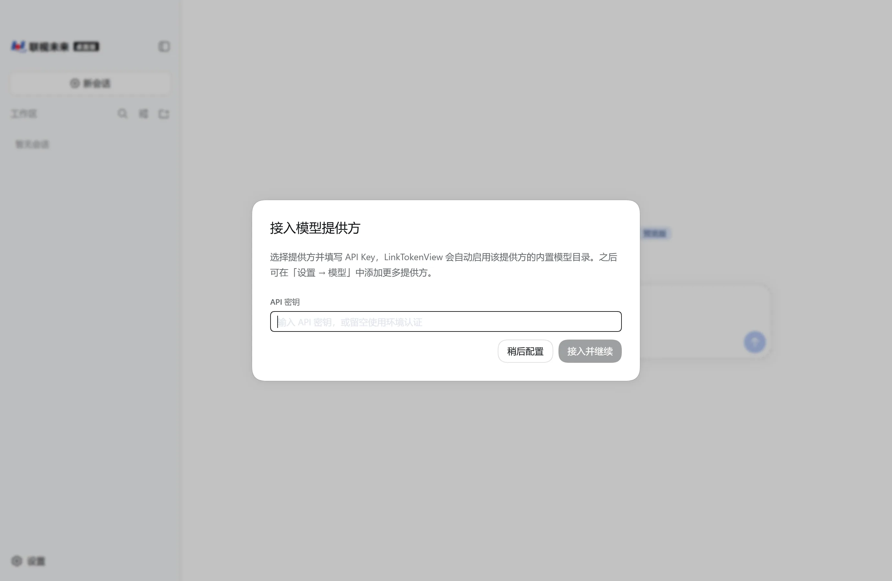
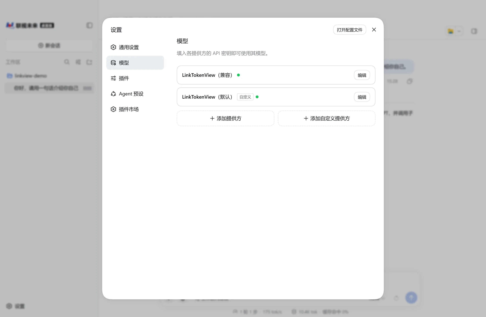
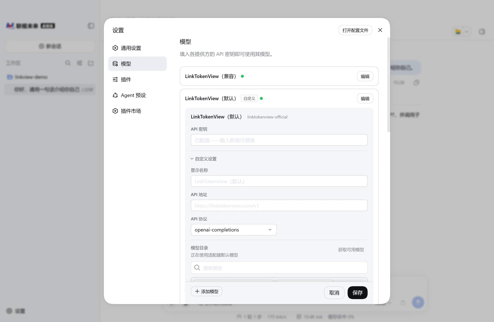
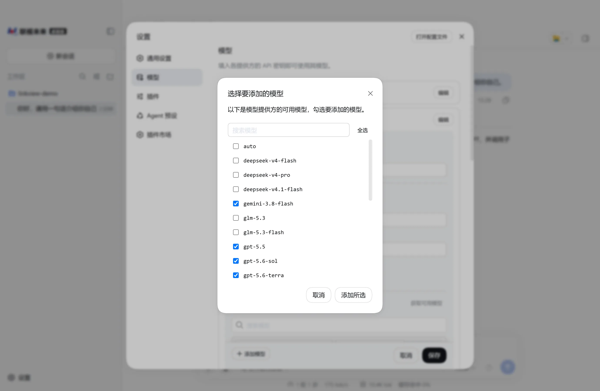
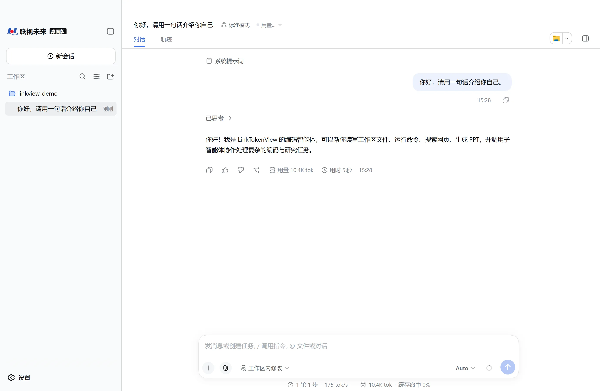

# LinkTokenView 桌面版 接入

LinkTokenView 桌面版是平台提供的 Windows 桌面客户端，内置编码 Agent。装好后填入平台 API 密钥即可使用，不需要借助 CC Switch 等第三方配置工具。

## 下载与安装

1. 打开 [https://linktokenview.com/download/](https://linktokenview.com/download/)。
2. 在「客户端工具」中找到 **LinkTokenView 桌面版**，点击 **立即下载 (.rar · 179 MB)** 按钮。
3. 解压下载的压缩包。
4. 打开解压出的文件夹，双击 **LinkTokenView.exe** 启动。

> 下载的是压缩包，解压后直接运行，没有安装向导。

## 首次启动填写密钥

1. 首次启动会先显示「内测声明」，点击 **继续**。
2. 弹出「接入模型提供方」窗口后，在 **API 密钥** 中粘贴你的 LinkTokenView API 密钥。
3. 点击 **接入并继续**。

> 密钥还没准备好？点击 **稍后配置** 跳过，之后按下面「确认模型」的步骤在「设置 → 模型」中填写。

> 如果启动时询问「发现网页版数据」，而你不需要导入，选择 **从空白开始**。网页版的数据不会被改动。

## 确认模型

桌面版已经预置好平台提供方，API 地址和协议都已填好，这一步只需要确认密钥已经生效。

1. 点击左下角的 **设置**。
2. 在左侧选择 **模型**。
3. 在列表中找到 **LinkTokenView（默认）** 条目，点击右侧的 **编辑**。

> 列表中有两个提供方：**LinkTokenView（默认）** 是日常使用的线路，**LinkTokenView（兼容）** 是保留的兼容线路。两者共用同一把平台密钥，按本页配置 **LinkTokenView（默认）** 即可。

4. 展开 **自定义设置**，确认 **API 地址** 为 `https://linktokenview.com/v1`。

5. 点击 **获取可用模型**。
6. 在弹出的「选择要添加的模型」窗口中勾选要使用的模型，点击 **添加所选**。

7. 点击 **保存**。

> 能选到哪些模型取决于你的密钥权限，以窗口中的实际列表为准。模型介绍见[模型广场](/model-plaza)。

## 发起请求

1. 点击左上角的 **新会话**。
2. 点击 **选择工作区**，指定一个本地文件夹作为工作目录。
3. 点击输入框右下角的模型按钮，选择要使用的模型。默认是 `Auto`，由平台按可用性自动路由。
4. 在输入框中描述任务并发送，确认返回正常结果。

## 出错时

- 确认 **API 地址** 为 `https://linktokenview.com/v1`，末尾包含 `/v1`。
- 确认 API 密钥内容完整，且不含多余空格。
- 确认「模型目录」中已添加至少一个模型；没有模型时无法发起请求。
- **获取可用模型** 失败时，先确认密钥有效、余额或订阅状态正常，见[余额与用量](/usage)。
- 确认模型仍在[模型广场](/model-plaza)显示。
- 没有对应配置项时，不要复制其他工具的环境变量、配置文件、模型 ID 或 API 路由；请记录版本和错误提示，再查看[配置失败排查](/troubleshooting/configuration)。
