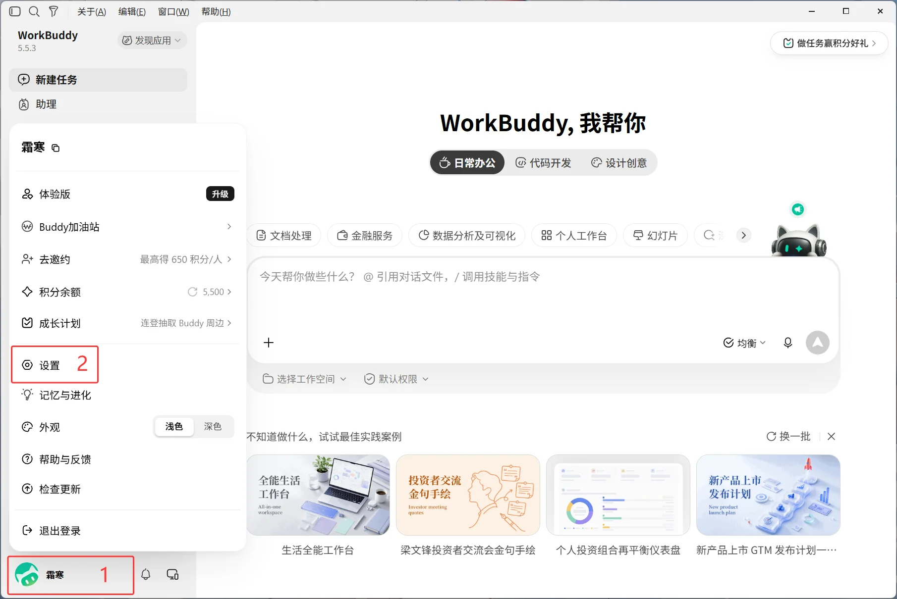
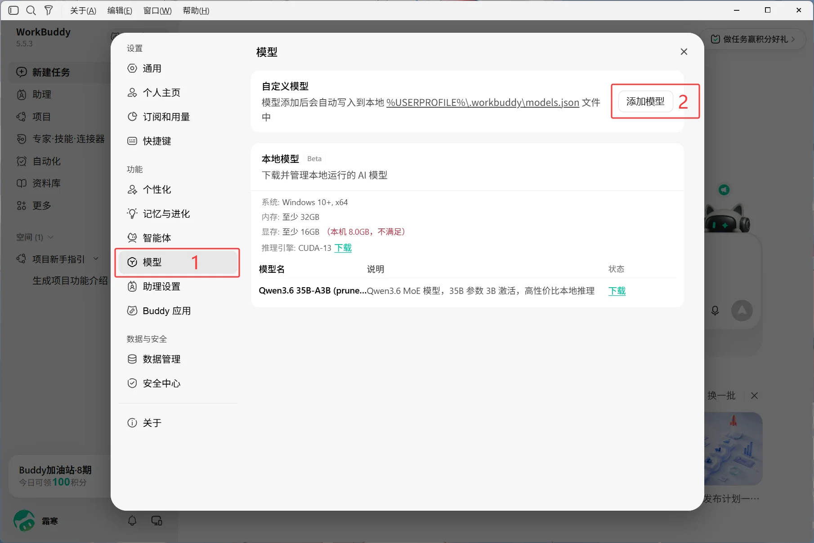
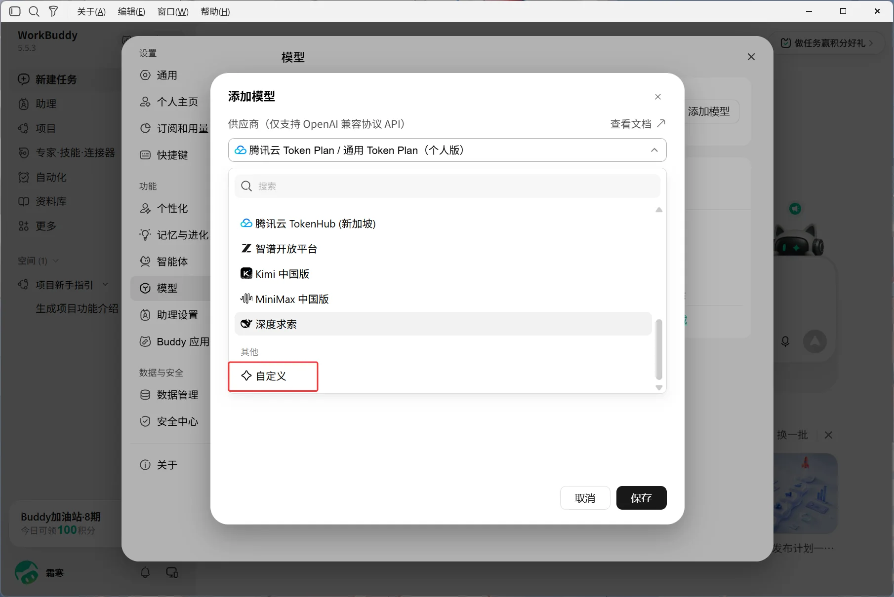
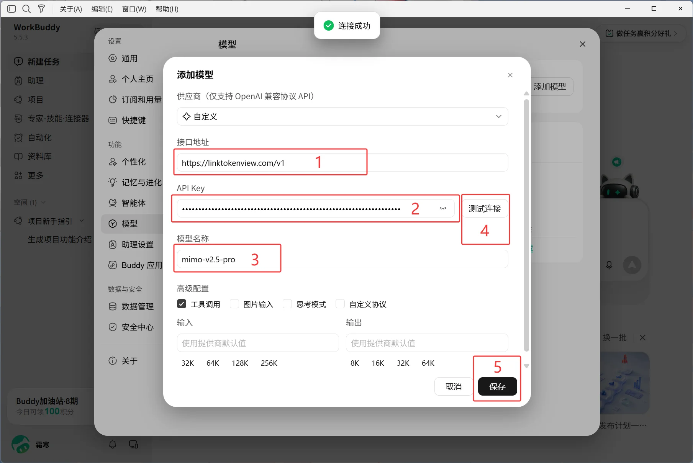
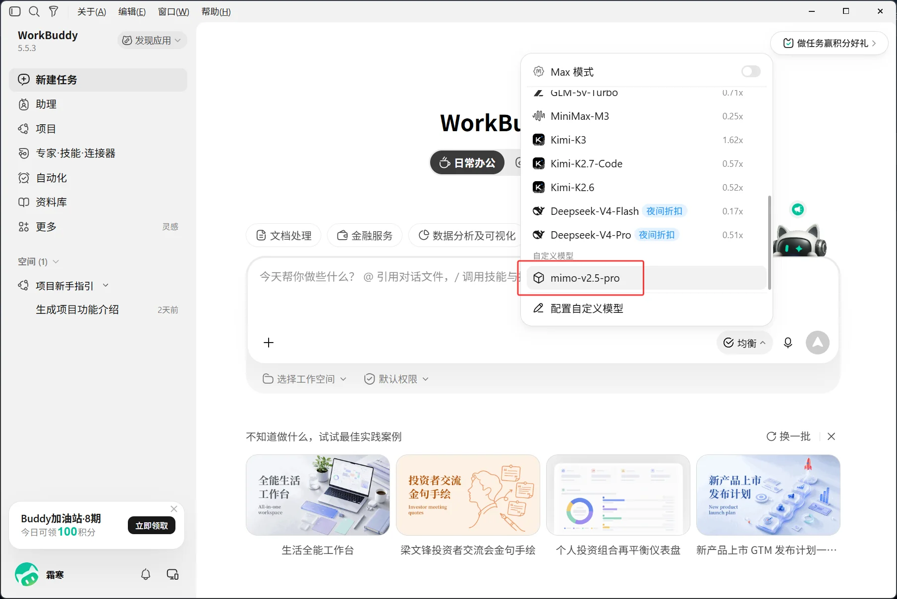

# WorkBuddy 桌面版 接入

## 配置前

- 已完成[注册与登录](/getting-started)。
- 已创建 LinkTokenView API 密钥，详见[创建 API 密钥](/api-keys)。
- 已安装并能正常启动当前版本的 WorkBuddy 桌面版。
- 已在[模型广场](/model-plaza)确认要使用的模型信息。
- **官方网站**：[https://www.workbuddy.cn](https://www.workbuddy.cn)
- **下载地址**：访问官网首页，点击「立即下载」。

## 添加自定义模型

### 1. 打开设置

1. 点击 WorkBuddy 主界面左下角的 **头像**；
2. 在弹出的菜单中选择 **设置**。

### 2. 进入模型配置

1. 在设置面板左侧导航栏中选择 **模型**；
2. 在 **自定义模型** 区域点击 **添加模型**。

### 3. 选择供应商

在弹出的 **添加模型** 对话框中，展开 **供应商** 下拉列表，滚动至底部选择 **自定义**。

### 4. 填写连接信息

选择自定义供应商后，填写以下字段：

| 字段 | 填写内容 |
|------|---------|
| 请求地址（Base URL） | `https://linktokenview.com/v1` |
| API Key | 你的 LinkTokenView API 密钥 |
| 模型名称 | 在[模型广场](/model-plaza)确认的模型 ID，例如 `mimo-v2.5-pro` |

> 请求地址因工具而异：WorkBuddy 与 DeepSeek Harness 使用 `https://linktokenview.com/v1`，CC Switch 使用根地址 `https://linktokenview.com`。请按对应页面填写，不要跨页面复制。

1. 点击 **测试连接**，确认页面提示「连接成功」；
2. 检查无误后，点击 **保存**。

### 5. 选择模型

保存成功后返回 WorkBuddy 主界面：

1. 点击输入框下方的模型切换按钮；
2. 在模型列表底部找到 **自定义模型** 分类，选择已添加的模型即可开始使用。

> **提示：** 模型添加后会自动写入到本地 `%USERPROFILE%\.workbuddy\models.json` 文件中，无需手动编辑配置文件。

## 出错时

- 确认 API 密钥填写正确。
- 确认保存的是 WorkBuddy 实际使用的配置。
- 重新打开 WorkBuddy，再发起请求。
- 确认模型仍在[模型广场](/model-plaza)显示。
- 没有对应配置类型时，不要复制其他工具的环境变量、配置文件、模型 ID 或 API 路由；请记录版本和错误提示，再查看[配置失败排查](/troubleshooting/configuration)。
