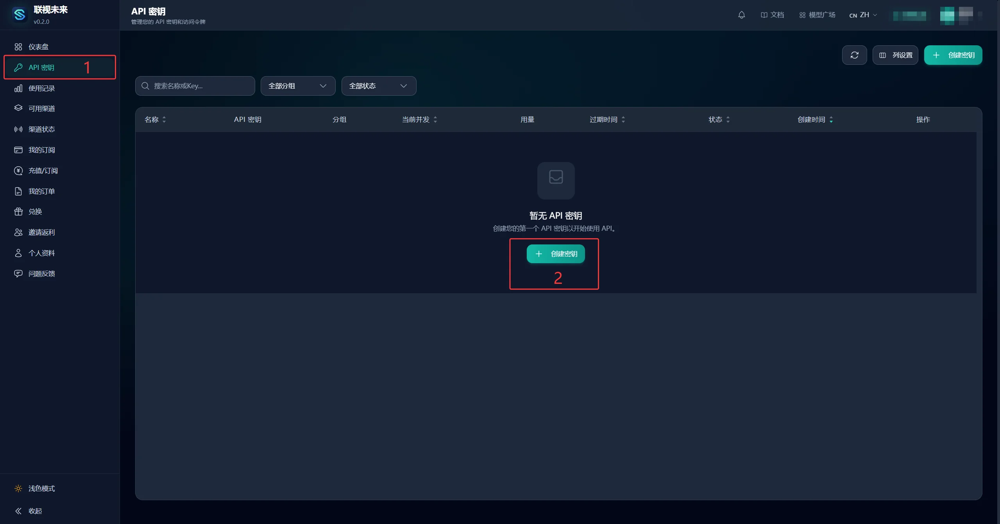
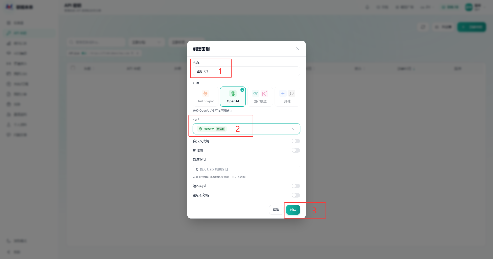
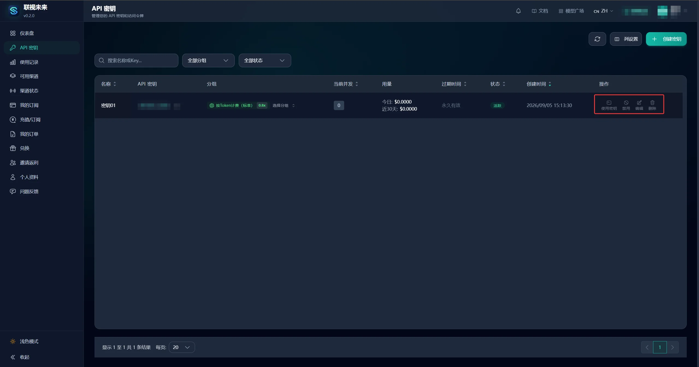

# API 密钥

## 创建密钥

1. 登录控制台，点击左侧的 **API 密钥**，再点击 **创建密钥**。

2. 填写以下信息：
   - **名称**：填写便于识别的名称，例如“密钥01”；
   - **分组**：选择计费分组，例如「按Token计费（标准）0.8x」。

   可选配置包括：
   - **自定义密钥**：自定义密钥内容
   - **IP 限制**：限制允许访问的 IP 地址
   - **额度限制**：设置密钥可消费的最大金额（USD），0 为无限制
   - **速率限制**：控制请求频率
   - **密钥有效期**：设置密钥的过期时间

   填写完成后点击 **创建**。

3. 创建成功后，密钥会显示在列表中。保存好密钥内容。

## 管理密钥

密钥列表会显示名称、脱敏后的密钥、分组、用量、过期时间、状态和创建时间。

每条密钥可以：

- **使用密钥**：生成 Agent 工具配置，参阅[快速开始](/first-call)；
- **禁用**：暂时停止 API 访问；
- **编辑**：修改名称、分组等信息；
- **删除**：永久删除密钥，无法恢复。

## 安全提醒

- API 密钥是访问凭证，不要发到公开渠道或提交到代码仓库。
- 怀疑泄露时，立即禁用或删除旧密钥，再创建新密钥。
