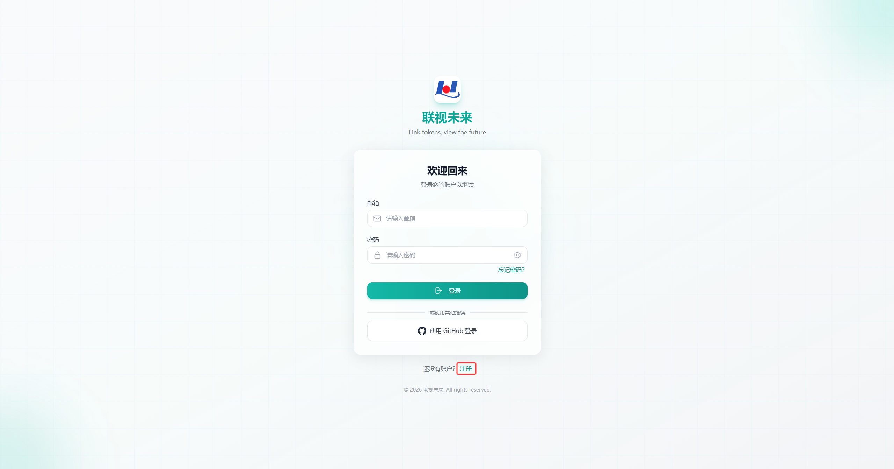
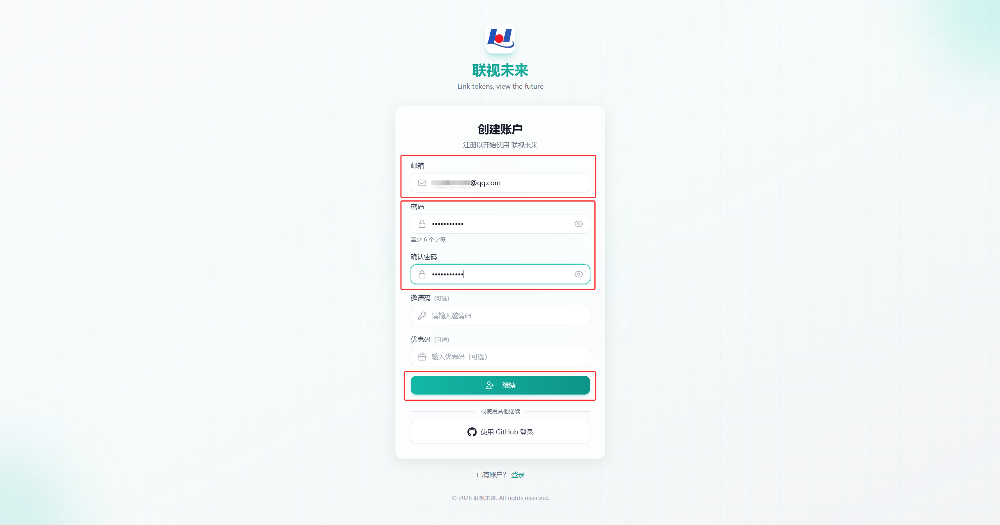
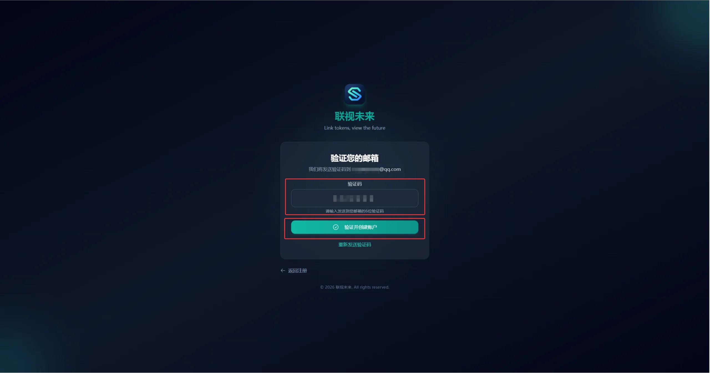
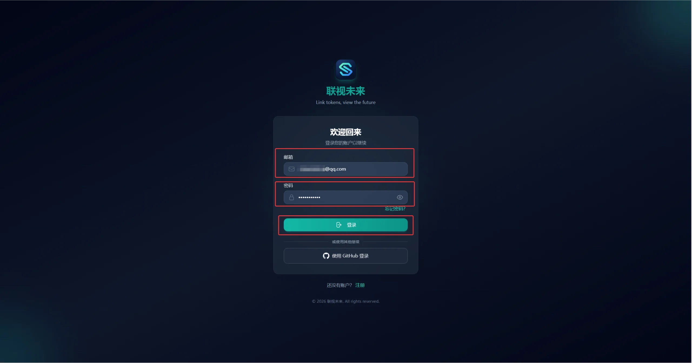
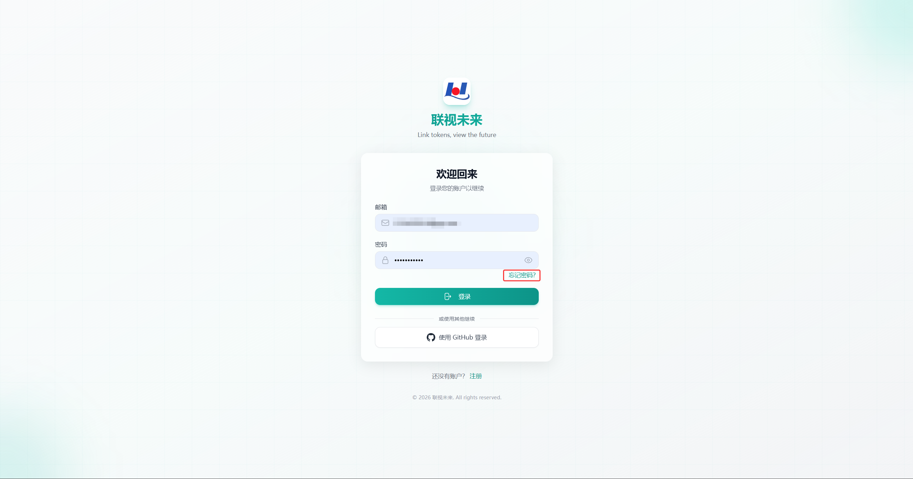
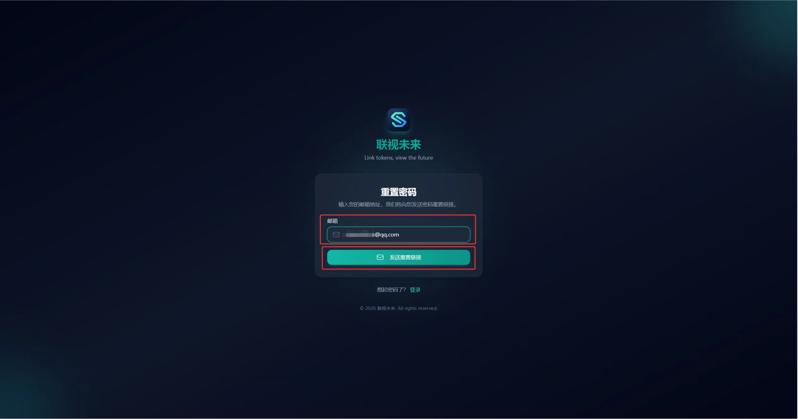

# 注册与登录

## 注册

1. 打开 [https://linktokenview.com](https://linktokenview.com) 登录页面，点击底部的 **注册**。

2. 填写注册信息，点击 **继续**：
   - **邮箱**：输入有效的邮箱地址
   - **密码**：设置密码，至少 6 个字符
   - **邀请码**（可选）：如有邀请码可填写
   - **优惠码**（可选）：如有优惠码可填写

3. 输入邮箱收到的 6 位验证码，点击 **验证并创建账户**。

## 登录

打开 [https://linktokenview.com/login](https://linktokenview.com/login)，输入注册邮箱和密码，点击 **登录**。

> 也支持使用 GitHub 账号登录，点击页面底部的「使用 GitHub 登录」即可。

## 忘记密码

1. 在登录页面点击 **忘记密码？**。

2. 输入注册邮箱，点击 **发送重置链接**。
3. 打开邮件中的重置链接，设置新密码。

## 登录失败

检查以下内容：

- 邮箱地址是否正确，注意大小写；
- 密码是否正确，注意大小写；
- 忘记密码时，按上面的流程重置；
- 仍无法登录时，联系[客服](/support)。
