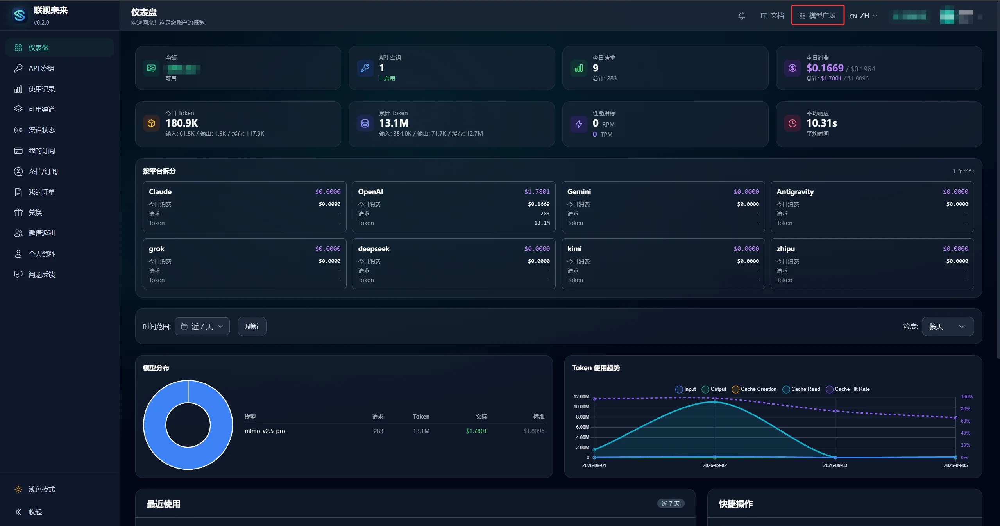
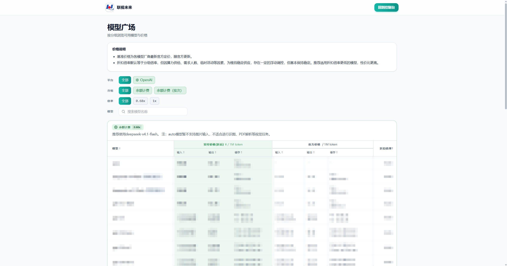

# 模型广场

在这里查看可用模型、模型 ID 和价格。

## 进入模型广场

登录 LinkTokenView 后，在顶部导航栏点击 **模型广场** 即可进入。

## 看懂价格

页面顶部会说明价格计算方式：

- 页面仅展示美元 $ 符号，全部调用实际以人民币扣费，换算关系为 1:1。
- 倍率 > 1 不是加价，为汇率换算系数，用于把上游成本换算成人民币等效展示。
- 基准价格为各模型厂商最新官方定价，随官方更新。
- 模型以官方输出价格降序排列，不代表模型能力排名。

## 查找模型

可以按以下条件筛选：

- **平台**：按模型厂商平台筛选（如 Claude、OpenAI、Gemini 等）。
- **分组**：按模型分组类别筛选。
- **倍率**：按折扣倍率范围筛选。
- **模型搜索**：输入模型名称关键词，快速定位目标模型。

## 价格表

表格中的主要字段：

- **模型**：模型名称及标识。
- **实付价格（折后）**：经过折扣后的实际支付价格（$ / 1M token），分为输入、输出、缓存三列。
- **官方价格**：模型厂商的官方定价（$ / 1M token），同样分为输入、输出、缓存三列。
- **折扣倍率**：LinkTokenView 相对于官方价格的折扣比例。

## 配置前

- 配置 Agent 工具前，先在这里确认模型 ID 和价格。
- 计费规则参阅[定价与订阅](/pricing)。
