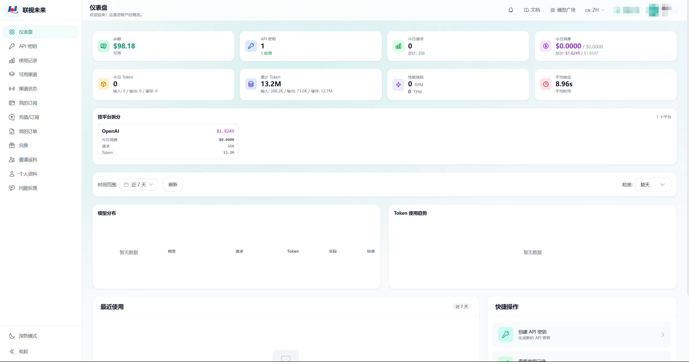
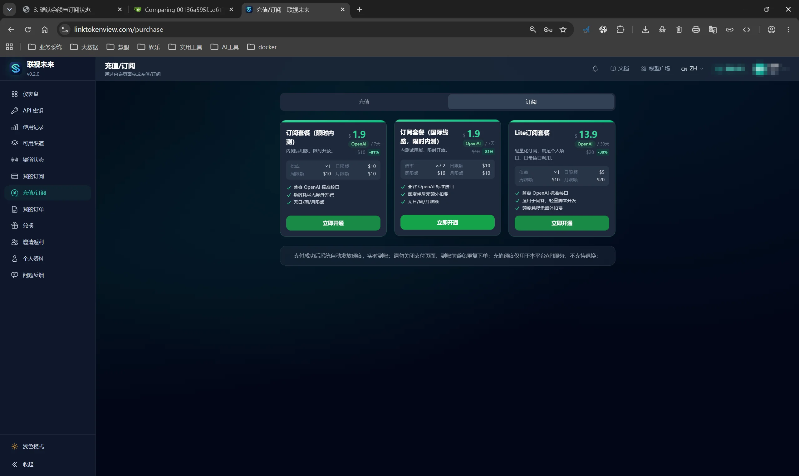

# 余额与用量

## 查看余额

登录控制台，打开**仪表盘**查看余额和用量：

- **余额**：当前可用余额
- **今日请求 / 累计 Token**：当日和历史的 Token 消耗情况
- **今日消费**：当日实际消费金额及总计

页面还提供平台、模型和 Token 用量的明细。

## 充值/订阅

进入控制台左侧的**充值/订阅**页面，可选择充值或订阅两种方式：

- **充值**：按需充值，直接增加账户余额
- **订阅**：选择套餐包月使用，页面提供多种套餐，根据需求点击对应套餐的 **立即开通** 按钮完成订阅

> 支付成功后系统自动发放额度，实时到账。请勿关闭支付页面，到账前避免重复下单；充值额度仅用于本平台 API 服务，不支持退换。

## 查看记录

点击控制台左侧的**使用记录**，查看请求时间、模型、Token 用量和消费金额。记录支持按时间和分组筛选。

## 余额不足

如果调用提示余额或额度不足：

1. 打开仪表盘确认余额；
2. 进入**充值/订阅**页面完成充值或续订；
3. 到账后重新发起请求。
